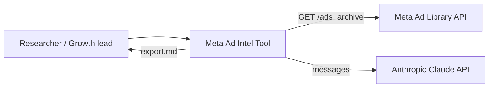
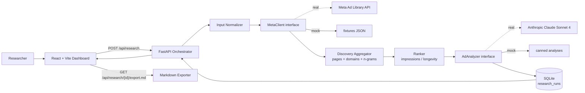
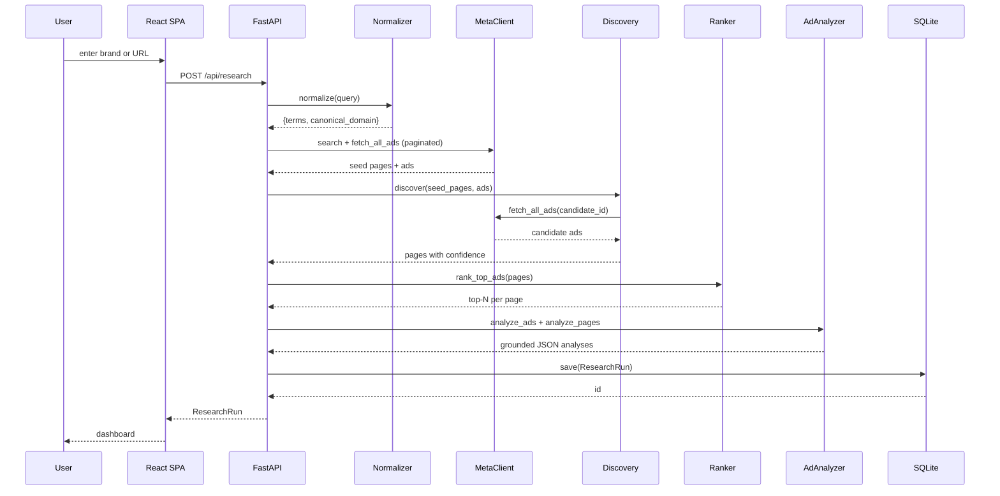
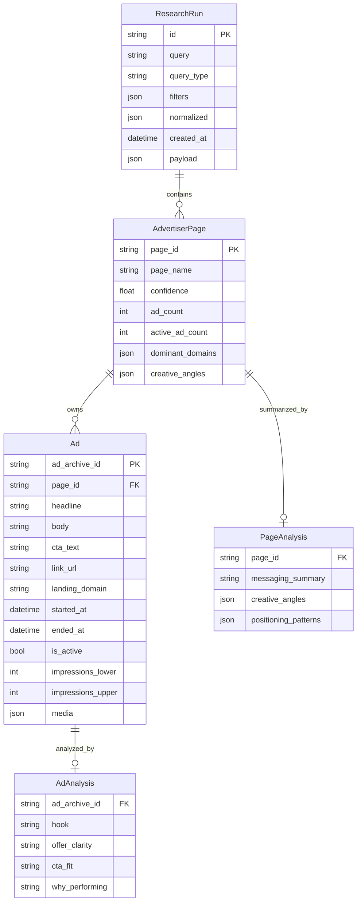
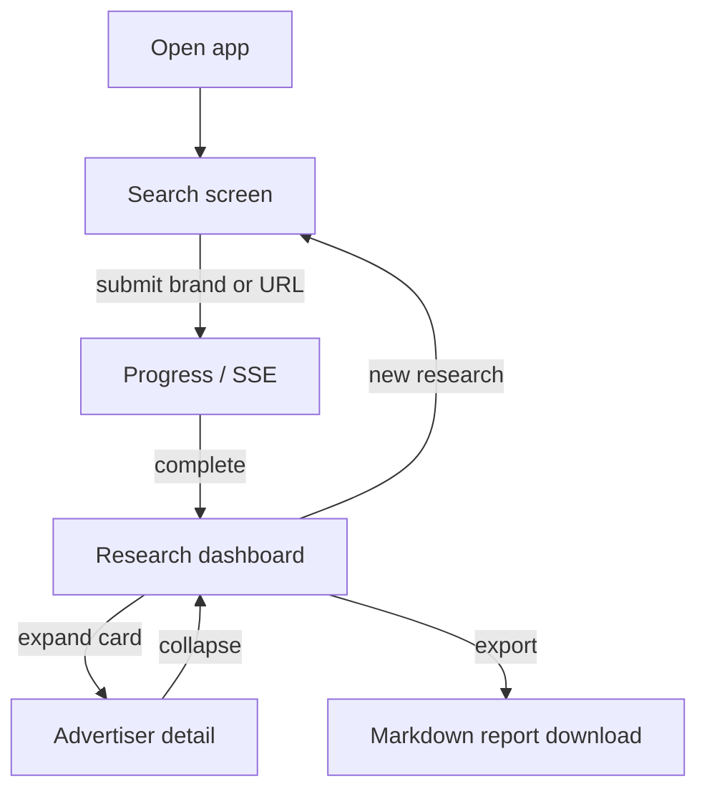

# ARCHITECTURE.md

System design for the Meta Ad Library Intelligence Tool. Written as the primary technical artifact of the test-assignment proposal — code is intentionally not part of this iteration.

## Table of contents

1. [System context](#1-system-context)
2. [Container view](#2-container-view)
3. [Stack and rationale](#3-stack-and-rationale)
4. [Data model](#4-data-model)
5. [API surface](#5-api-surface)
6. [Discovery — the core differentiator](#6-discovery--the-core-differentiator)
7. [AI layer](#7-ai-layer)
8. [Meta API resilience](#8-meta-api-resilience)
9. [UI / UX](#9-ui--ux)
10. [Risks and mitigations](#10-risks-and-mitigations)
11. [Open questions](#11-open-questions)
12. [Success metrics](#12-success-metrics)
13. [Required inputs to start v1](#13-required-inputs-to-start-v1)
14. [Assumptions](#14-assumptions)

---

## 1. System context



**Actors and dependencies.**
- **Researcher** — single user role in v1. Submits a brand name or product URL, reviews the reconstructed ecosystem, exports a Markdown report.
- **Meta Ad Library API** — primary data source. Public-but-rate-limited, returns ads, page metadata, partial impression ranges.
- **Anthropic Claude API** — analysis layer for per-ad and per-page reasoning under grounding constraints.
- **System boundary** — everything else (orchestration, discovery, persistence, UI, export) lives inside our containers.

The system has no other external dependencies in v1. No CRM, no analytics platform, no auth provider — kept off-scope deliberately.

---

## 2. Container view



**Three containers** in v1:

- **React + Vite SPA** — single-page application, served as static files in production.
- **FastAPI service** — async orchestrator, hosts all domain logic (normalizer, discovery, ranker, AI orchestration, export).
- **SQLite file** — single-file persistence for `ResearchRun` snapshots. Co-located with the FastAPI process; no separate DB server.

External clients (Meta, Anthropic) are accessed exclusively through `Protocol`-typed interfaces, with mock implementations selected by `USE_MOCKS=true` for development and demos.

### Sequence: a full research request



Long-running calls (full pagination, AI analysis) are streamed back via Server-Sent Events with stage markers (`normalize`, `fetch`, `aggregate`, `rank`, `analyze`, `persist`) so the UI can show progress without polling.

---

## 3. Stack and rationale

### Backend: FastAPI (Python 3.11+)

| Alternative | Why rejected |
|---|---|
| Node/Express | Pydantic gives a stricter typed contract than ad-hoc Zod schemas; auto-generated OpenAPI is a freebie that drives frontend types. |
| Django | Heavy for a service that has one resource (`ResearchRun`) and no built-in auth/admin needs. |
| Flask | No first-class async; we need async for paginated fan-out to Meta. |

**Decisive properties:** native `async`/`await` for paginated and parallel HTTP fan-out, Pydantic for the contract that both the AI structured-output layer and the React frontend consume, OpenAPI generation for `openapi-typescript`-driven TS types.

### Frontend: React + Vite + TypeScript + Tailwind

| Alternative | Why rejected |
|---|---|
| Next.js (App Router) | SSR/RSC is unnecessary for an internal research dashboard. Adds dev-loop overhead and routing decisions we don't need. |
| Plain Vite + JS | Types are non-negotiable when the contract is generated from Pydantic. |
| Remix / TanStack Start | Same overhead as Next.js, no compensating benefit. |

**Decisive properties:** fast dev-loop on Vite, no SSR needed, Tailwind + shadcn/ui for clean cards without designing a system from scratch, React Query for server-cache semantics around `ResearchRun`.

### Persistence: SQLite

| Alternative | Why rejected |
|---|---|
| PostgreSQL | Zero-ops gain matters more than concurrency in v1. Adds a service to run, a connection pool to tune, migrations to author. Migration to Postgres is in v2 (see [ROADMAP.md](./ROADMAP.md)). |
| Redis-only | We need durable snapshots for deterministic export. |
| In-memory | Loses research runs on restart, breaks export reproducibility. |

**Boundary of fitness.** SQLite is fine while: concurrent writers ≤ 1, total DB size < 5 GB, queries are point-lookups by `research_run.id`. The day any of those breaks, we move to Postgres — explicit gate in v2.

### AI: Anthropic Claude Sonnet 4

| Alternative | Why rejected |
|---|---|
| GPT-4o | Sonnet 4 has a longer context for page-level prompts (10–20 creatives + descriptions) and stronger structured-output adherence in our internal experience; price is comparable. |
| Local model (Llama, Mixtral) | Quality on grounded reasoning over short ad copy is below frontier models; ops cost (GPU) inappropriate for a prototype. |
| Claude Haiku | Cheaper but weaker on the multi-creative page-level prompt; we'd lose the cross-creative pattern detection that justifies the AI layer. |

**Decisive properties:** 200K context comfortably fits 10–20 creatives in the per-page prompt, native JSON tool-use produces valid structured output without retry loops, batch API support for cost reduction in v2.

### Cross-cutting principles

- **Mock-first.** Both `MetaClient` and `AdAnalyzer` ship with mock implementations from day one. Real implementations are added behind the same `Protocol` and selected by config — no consumer changes.
- **Interface-driven.** Every external boundary is a `Protocol`. The aggregator, ranker, and analyzer take protocol-typed dependencies, not concrete classes.
- **Partial-data tolerance.** All Pydantic fields that come from Meta are `Optional` except the two stable identifiers (`ad_archive_id`, `page_id`). The aggregator must produce sensible output even when half the fields are `None`.

---

## 4. Data model



**Key invariants.**
- `Ad.impressions_upper >= Ad.impressions_lower` whenever both are present.
- `Ad.is_active ⟺ Ad.ended_at IS NULL`.
- `AdvertiserPage.confidence ∈ [0, 1]`. Seed pages have `confidence = 1.0`.
- `ResearchRun.payload` is a complete JSON snapshot of the result. Re-rendering the dashboard or re-exporting the report does not re-call Meta or Anthropic — both operations are deterministic against `payload`.

**Retention policy.** Research runs have a default TTL of 30 days. After expiry the row is deleted; the export is no longer reproducible. This is a v1 simplification — long-term retention and per-user history are v2 concerns.

---

## 5. API surface

| Method | Path | Purpose |
|---|---|---|
| `POST` | `/api/research` | Run a new investigation. Body: `{query: str, type: "brand"\|"url", filters?: {...}}`. Returns `ResearchRun`. |
| `GET` | `/api/research/{id}` | Re-open a stored run from SQLite. |
| `GET` | `/api/research/{id}/export.md` | Deterministic Markdown report. `Content-Type: text/markdown; charset=utf-8`. |
| `GET` | `/api/research/{id}/events` | SSE stream with progress markers, used by the UI during a long `POST /api/research`. |
| `GET` | `/api/health` | Liveness. |

**Error contract.** `422` on malformed query (validated by Pydantic), `429` when Meta rate limit is hit and our retry budget is exhausted (with `Retry-After` surfaced from the Meta response), `502` on upstream Meta or Anthropic failure, `504` when a research run exceeds `MAX_DURATION_SECONDS` (the orchestrator times out waiting for the pipeline), `404` on unknown `research_run.id`. All errors include a stable `error_code` (e.g. `meta_rate_limited`, `pipeline_timeout`, `ai_invalid_json`) for the UI to map to localized messages later.

**Long-request strategy.** A research run typically takes 15–90 seconds on real Meta data. Two viable shapes:

1. *Synchronous with SSE progress* — chosen. Client opens the request, server pushes stage markers; final response includes `ResearchRun`.
2. *Async task* — `POST` returns `{job_id}` immediately, client polls or subscribes. Adds complexity (job table, worker process, retries) without functional gain at v1 traffic.

The SSE approach scales to v2 by replacing the in-process generator with an RQ/Celery worker that publishes events to Redis pub-sub.

---

## 6. Discovery — the core differentiator

This is the section the entire product depends on. The thesis is: **competitors rarely run from one page**, so a tool that returns only the seed page reproduces ~10–30% of the truth. The discovery layer expands the seed into the *ecosystem* using independent signals from the data we already pull.

The four ecosystem patterns we explicitly target — taken from the assignment statement — are: **brand-owned pages**, **agency-managed pages**, **persona-style accounts**, and **parallel creative-testing structures** (the same offer rotated across multiple pages to compare performance under different account contexts). They share a structural property exploited below: either a common landing destination or a recurring creative-copy pattern (or both).

### 6.1 Problem formalization

**Given:** a query — either a brand name string or a product URL.
**Find:** a set `E = {(page_i, confidence_i)}` of advertiser pages, where `page_i` is judged to belong to the same advertising ecosystem as the query, and `confidence_i ∈ [0, 1]` is the strength of evidence.

**Pre-step: input normalization.** The raw query is canonicalized before any signal extraction:
- If a URL: parse to eTLD+1 (`https://www.acme-fitness.com/products/30day?utm_source=fb` → `acme-fitness.com`).
- Tracking parameters (`utm_*`, `gclid`, `fbclid`, `ref`, `_ga`) are **stripped from the canonical form** for the domain signal, but **retained in raw form** for the UTM signal during candidate matching (§6.2). The two views of the same `link_url` are intentional.
- Search terms are derived from the eTLD+1 stem and any meaningful URL path slug (`/products/30day` → `["30day"]`). For brand-name queries, the string is used as-is.

**Constraints:**
- We work only with Meta Ad Library data — no scraping, no external enrichment in v1.
- The graph is computed at *query time* on the result set; we do not maintain a global graph between queries.
- Traversal depth is bounded (see §6.4) to keep run times predictable.

### 6.2 Signals of relatedness between pages

Each signal is computed pairwise between two pages `a` and `b` over their respective ad sets, normalized to `[0, 1]`, and combined linearly with the weights below.

| Signal | Weight `w_i` | Source | Noise mitigation |
|---|---:|---|---|
| Shared `landing_domain` (eTLD+1) | **0.40** | `Ad.link_url` parsed to eTLD+1 | Excluded CDN list (cdn.shopify.com, fbcdn, cloudfront, etc.); known affiliate-network domains down-weighted. |
| n-gram overlap of headlines and body openings (k≥3, Jaccard ≥ 0.3) | **0.25** | `Ad.headline`, first sentence of `Ad.body` | Stop-list of generic ad phrases ("buy now," "limited time," "free shipping," "click here") removed before n-gram extraction. |
| Shared CTA + value-prop pattern (normalized) | **0.15** | `Ad.cta_text` + first line of `Ad.body` | Standard CTAs ("Shop Now," "Learn More") contribute 0; only non-trivial CTAs count. |
| Active-period overlap of ad campaigns | **0.10** | `started_at`, `ended_at` | Low weight — supportive signal, not decisive on its own. |
| Shared UTM `utm_source` / `utm_campaign` (non-trivial) | **0.10** | parsed query string of `link_url` | If absent, signal contributes 0 (not a penalty). |

Weights are **expert priors**, not learned. The dominance of the domain signal (0.40) reflects an empirical observation that a shared landing domain is the strongest single indicator of co-ownership; n-gram overlap is the next-most-reliable signal because reusing creative copy is cheap and operationally common across pages an advertiser controls.

The structured calibration of these weights against ground truth is an explicit v2 task — see [ROADMAP.md](./ROADMAP.md).

### 6.3 Confidence scoring

```
confidence(a, b) = Σ_i w_i · s_i(a, b)
where s_i ∈ [0, 1] is the normalized strength of signal i.

Membership threshold:    confidence ≥ 0.45  →  page belongs to the ecosystem
Strong-link threshold:   confidence ≥ 0.70  →  highlighted in UI as "strong"
```

The 0.45 threshold is chosen so that **two strong signals are sufficient** (e.g., shared domain at 0.40 + a small n-gram contribution of 0.10 puts a pair at exactly 0.50), while **a single supporting signal is not** (e.g., UTM-only at 0.10 falls well below). This is a deliberate bias toward precision over recall; see §6.5 case 5.

### 6.4 Algorithm (pseudocode)

```python
def discover(raw_query):
    query = normalize(raw_query)                   # see §6.1 pre-step
    seed_pages = meta.search(query.terms)          # cursor-paginated

    # First hop: collect related-candidates from seed pages' ads.
    candidate_pool = set()
    for page in seed_pages:
        page.ads = meta.fetch_all_ads(page.id)     # cursor-paginated, cache-aware
        page.confidence = 1.0
        candidate_pool |= extract_related(page.ads)  # domains, n-grams, UTMs

    # Second hop: score candidates against the growing ecosystem.
    expanded_pages = []                            # plain list of pages, scores attached on the page object
    seen_ids = {p.id for p in seed_pages}
    for cand in candidate_pool:
        if cand.id in seen_ids:
            continue
        cand.ads = meta.fetch_all_ads(cand.id)
        reference_pages = seed_pages + expanded_pages
        score = max(
            confidence(cand.ads, ref.ads)
            for ref in reference_pages
        )
        if score >= 0.45:
            cand.confidence = score
            expanded_pages.append(cand)
            seen_ids.add(cand.id)

    # Rank top creatives per page (impressions desc, longevity fallback).
    pages = seed_pages + expanded_pages
    for page in pages:
        page.top_ads = rank(
            page.ads,
            primary=lambda a: a.impressions_upper or 0,
            fallback=lambda a: longevity_days(a),
        )[:5]
    return pages
```

**Traversal depth is bounded to 2 hops** from the seed pages. Each candidate that crosses the 0.45 threshold could in principle introduce its own related-candidates, but unbounded expansion risks pulling in shared-CDN tangents and exploding the result set. Two hops are sufficient to find brand → agency → persona-grid structures observed in practice; deeper structures are rare and v2 territory if they appear in the ground-truth set.

`meta.fetch_all_ads` is **cache-aware**: a second call for the same `page.id` within a research run is served from an in-memory dict; across runs, the 24-hour SQLite cache (§8) absorbs the load. This is why the algorithm does not pre-fetch all candidate ads in batch — fetches are idempotent and cheap on the second pass.

### 6.5 Synthetic cases

These five cases are designed to be the calibration set for v1 fixtures. Each case exercises a specific signal combination and validates a specific algorithmic property.

**Case 1 — Brand + single agency. (Baseline scenario.)**
Seed `Acme Fitness` matches one page. That page's ads link to `acme-fitness.com`. A separate page `Acme Promo Hub` runs ads to the same domain.
- domain: 1.0 (×0.40 = 0.40)
- n-gram: ~0.4 (×0.25 = 0.10)
- CTA: ~0.5 (×0.15 = 0.075)
- period: 1.0 (×0.10 = 0.10)
- UTM: 1.0 (×0.10 = 0.10)
- **confidence ≈ 0.78 → strong link.** Demonstrates the simplest path from seed to discovered.

**Case 2 — Persona network. (The case the product is built for.)**
Seed `Acme Fitness` matches one page. Four additional pages — `Sarah's Fitness Tips`, `Mike Trains Hard`, `Olivia's Workout Diary`, `Coach Ben's Tips` — never mention "Acme" by name. They all link to `acme-fitness.com` and share an identical CTA-value-prop block ("Try the 30-day program — free first week").
- domain: 1.0 (×0.40 = 0.40)
- n-gram: ~0.7 on the CTA block (×0.25 = 0.175)
- CTA: 1.0 on the normalized pattern (×0.15 = 0.15)
- period: ~0.8 (×0.10 = 0.08)
- UTM: 1.0 if `utm_campaign=persona_test_q3` is shared (×0.10 = 0.10)
- **confidence ≈ 0.82–0.91 → strong links.** A naive name-based search would return one page out of five. This is the differentiator.

**Case 3 — White-label media via Shopify CDN. (Stop-list validation.)**
Two unrelated brands, `Brand-A` and `Brand-Z`, both serve images from `cdn.shopify.com`. Without filtering, the domain extraction step would treat the CDN as a shared landing domain.
- The CDN stop-list excludes `cdn.shopify.com` from the domain signal (it's a media host, not a landing destination).
- n-gram, CTA, period, UTM signals all near 0.
- **confidence ≈ 0.0 → no link.** Demonstrates the stop-list works.

**Case 4 — Language splits. (Robustness to internationalization.)**
A single brand operates two pages: `Acme Fitness EN` and `Acme Fitness ES`. Creative bodies are in English and Spanish respectively, so n-gram overlap is near zero. They share the landing domain and one UTM campaign.
- domain: 1.0 (0.40)
- n-gram: ~0.05 (0.0125)
- CTA: ~0.0 (0.0) — different languages
- period: 1.0 (0.10)
- UTM: 1.0 (0.10)
- **confidence ≈ 0.61 → ecosystem member, not strong.** The system finds the connection without overstating its confidence — an honest behavior we want.

**Case 5 — Shared affiliate program. (False-positive rejection.)**
Two unrelated direct-to-consumer brands, `Brand-Q` and `Brand-W`, both run through an affiliate network `aff-net.com` and include `?ref=aff-net` in some ads. They share no domain, no creative copy, no CTA pattern.
- domain: 0.0 (different)
- n-gram: 0.0
- CTA: 0.0
- period: ~0.3 (some overlap, but low weight)
- UTM: 1.0 on `ref=aff-net` (0.10)
- **confidence ≈ 0.13 → below 0.45 threshold, not linked.** Demonstrates the conservative threshold prevents the affiliate program from collapsing two competitors into one ecosystem.

### 6.6 Edge cases and countermeasures

- **Page with no active ads** — fall back to archive ads, mark page as `inactive ecosystem member` in the UI. Confidence is computed identically.
- **Meta omits `link_url` for some video formats** — domain signal is unavailable; degrade gracefully by re-weighting on n-gram + CTA (renormalize remaining weights to sum to 1.0 for that pair).
- **Very short creatives (≤ 10 words)** — n-gram extraction is unreliable; disable n-gram signal, slightly increase domain weight.
- **Page rename across time** — `page_id` is stable, `page_name` is presentational only. The aggregator always keys on `page_id`.
- **Dynamic-feed catalog ads** — high creative variability per ad, low signal per pair. Treat catalog ads as a single logical creative for n-gram purposes.

### 6.7 Open questions on Discovery

- Calibration of weights is currently expert-set. v2 ground-truth dataset (§13) will let us either (a) fit weights via a logistic regression on `is_same_ecosystem`, or (b) keep them and add a confidence-distribution diagnostic.
- Visual signals (perceptual hashes of creatives, OCR of in-image text) are powerful but require media downloads; explicitly v2.
- Cross-locale propagation — when one strong signal links a page across languages, should the threshold lower for downstream candidates of that page? A research question, not a v1 decision.

---

## 7. AI layer

Two prompts, both producing structured JSON via the model's tool-use feature.

### 7.1 Per-ad prompt

**Input fields** passed into the prompt:
- `creative_body`, `headline`, `cta_text`
- `landing_domain`
- `impressions_upper`, `running_days`, `is_active`

**Output schema:**

```json
{
  "hook": "<exact phrase from creative_body that opens, plus 1-sentence why>",
  "offer_clarity": {
    "score": "<integer 1-5>",
    "reason": "<sentence citing a specific phrase from the body>"
  },
  "cta_fit": {
    "verdict": "<aligned | weak | mismatched>",
    "reason": "<sentence citing the cta_text and the body claim it should support>"
  },
  "why_performing": "<hypothesis grounded in impressions_upper, running_days, is_active>"
}
```

### 7.2 Per-page prompt

**Input:** array of top-N (default 5) ads of the page, plus aggregate facts (`page_name`, total ad count, active ad count, dominant landing domains).

**Output schema:**

```json
{
  "messaging_summary": "<2-3 sentences, each must reference at least one ad_id>",
  "creative_angles": [
    {"angle": "<short label>", "evidence_ad_ids": ["<id>", "..."]}
  ],
  "positioning_patterns": [
    {"pattern": "<short label>", "evidence": "<phrase quoted from one of the ads>"}
  ]
}
```

### 7.3 Grounding rules

The prompt includes the following non-negotiable instructions:

1. Every claim must cite a concrete element of the input — a phrase from the body, the exact CTA text, the landing domain, or a numeric metric.
2. Forbidden vocabulary list (compiled from real failures of generic LLM ad analysis): `engaging`, `compelling`, `eye-catching`, `powerful`, `effective`, `creative`, `innovative`, `dynamic`, `memorable`, `impactful`. The model is instructed to avoid these as standalone qualifiers.
3. The output must be valid JSON matching the schema; no prose preamble.

### 7.4 Post-validation

After receiving the response, the orchestrator runs a regex check against the forbidden vocabulary in the JSON values. On a hit:

1. Re-prompt once with: *"Your previous response used generic marketing terms instead of citing specific ad copy. Re-answer the same input and quote phrases directly from the creative body, headline, or CTA."*
2. If the second response also fails, store the response with a `quality: "weak"` flag and surface it in the UI with a warning badge, but do not retry further (cost control).

The grounding pass-rate (first-try success) is one of the success metrics — see §12.

### 7.5 Why Claude Sonnet 4

- **Context length.** The per-page prompt with 10–20 creatives and their media descriptions comfortably fits in the 200K window with room for the schema and the forbidden-vocabulary list.
- **Structured output.** Native JSON tool-use produces valid output without retry loops in our experience.
- **Cost (worked example, public Sonnet 4 pricing of $3/Mtok input, $15/Mtok output).** A 50-page research run with 5 top-ads per page:
  - **Input:** 50 per-page prompts × ~3K tok + 250 per-ad prompts × ~1K tok ≈ **400K tok**.
  - **Output:** ~150K tok of structured JSON.
  - **Standard pricing:** 0.4M × $3 + 0.15M × $15 ≈ **$3.45 per run, worst case**.
  - **Batch API (50% discount, generally available, scheduled for v2):** ≈ **$1.75 per run**.
  - **Per-page-only mode** (drop the per-ad prompt; keep only page-level summaries — a degraded but viable mode for cost-sensitive deployments): ≈ **$1.50 standard / $0.75 batch**.

These numbers are consistent with the v2 success-metric target in §12.3 and the development budget in §13.

The choice is reversible — both `OpenAI` and self-hosted alternatives can implement the same `AdAnalyzer` protocol.

---

## 8. Meta API resilience

The Meta Ad Library API is functional but constrained. Resilience properties baked into the `MetaClient`:

- **Cursor pagination loop.** Every list endpoint is exhausted to the empty `paging.next`. No "first 25 results" assumption anywhere upstream.
- **Exponential backoff with jitter** on `429` and `5xx`, using `tenacity` with `wait_random_exponential(min=1, max=60)` and a hard ceiling of 5 retries per request. Past that, the error is propagated up and the run continues without that fragment of data.
- **Partial-data tolerance.** All Pydantic ad fields except `ad_archive_id` and `page_id` are `Optional`. The aggregator and ranker always check for `None` and degrade signals gracefully (§6.6).
- **Session limits.** `MAX_PAGES_PER_RUN = 50`, `MAX_ADS_PER_PAGE = 200`, `MAX_DURATION_SECONDS = 300`. Predictability of cost and time matters more than completeness; the alternative — unbounded crawls — is hostile to both Meta and the user.
- **Response cache** keyed by `(page_id, fetched_at_day)` in SQLite. A second request to the same page within 24 hours is served from cache. Reduces both latency and rate-limit pressure for repeated investigations.

---

## 9. UI / UX

Three screens, designed for **read speed over visual complexity**.

### 9.1 Screen: Search (`/`)

```
┌──────────────────────────────────────────────────────────────┐
│   Meta Ad Library Intelligence                          [?]  │
├──────────────────────────────────────────────────────────────┤
│                                                              │
│   What are you researching?                                  │
│                                                              │
│   ( ) Brand name      (•) Product URL                        │
│                                                              │
│   ┌──────────────────────────────────────────────────┐       │
│   │ https://acme-fitness.com                         │       │
│   └──────────────────────────────────────────────────┘       │
│                                                              │
│   Country: [ All v ]    [x] Active ads only                  │
│                                                              │
│                                  [ Run research ]            │
│                                                              │
└──────────────────────────────────────────────────────────────┘
```

### 9.2 Screen: Research Dashboard (`/research/{id}`)

```
┌──────────────────────────────────────────────────────────────┐
│  acme-fitness.com   ·   discovered Mar 12, 2026   [Export ↓] │
├──────────────────────────────────────────────────────────────┤
│  PAGES: 5    ADS: 47    ACTIVE: 31    INACTIVE: 16           │
├──────────────────────────────────────────────────────────────┤
│  Timeline ────────────────────────────────────────────────   │
│  [bar chart of campaign starts/ends per page]                │
├──────────────────────────────────────────────────────────────┤
│  ▼ Acme Fitness                       seed   12 ads  8 active│
│    "30-day program — free first week" recurring across ads.  │
│                                                              │
│    ▷ Top creative #1     "Lose 10 lbs..."  imp 50K-100K  ★★★ │
│    ▷ Top creative #2     "Why mornings..."  imp 30K-50K  ★★  │
│    ...                                                       │
│                                                              │
│  ▼ Acme Promo Hub                  conf 0.78  9 ads  6 active│
│    Mirrors brand offers; agency-managed pattern.             │
│                                                              │
│  ▶ Sarah's Fitness Tips            conf 0.86 strong  8 ads   │
│  ▶ Mike Trains Hard                conf 0.82 strong  10 ads  │
│  ▶ Olivia's Workout Diary          conf 0.79 strong  8 ads   │
└──────────────────────────────────────────────────────────────┘
```

### 9.3 Screen: Advertiser detail (expanded card)

```
┌──────────────────────────────────────────────────────────────┐
│  ▼ Sarah's Fitness Tips           confidence 0.86  [strong]  │
├──────────────────────────────────────────────────────────────┤
│  Page summary                                                │
│  Persona-style account; consistently links to acme-fitness   │
│  .com; CTA "Try the 30-day program — free first week" appears│
│  in 7/8 active ads (refs ad_id 22..., 24..., 27...).         │
│                                                              │
│  Creative angles                                             │
│  · Personal-journey hook (ads 22, 24, 27)                    │
│  · Mornings / habit framing (ads 25, 28)                     │
├──────────────────────────────────────────────────────────────┤
│  Top creatives                                               │
│                                                              │
│  ┌──────────────────────────────────────────────────────┐    │
│  │ "I dropped 10 lbs without changing what I eat..."    │    │
│  │ CTA: Try free week                                   │    │
│  │ Active 47 days   imp 30K-50K                         │    │
│  │ ── AI analysis ────────────────────────────────────  │    │
│  │ Hook: "I dropped 10 lbs without changing what I eat" │    │
│  │   — first-person specific outcome.                   │    │
│  │ Offer clarity: 4/5 — "free first week" is concrete.  │    │
│  │ CTA fit: aligned — body promises a try, CTA delivers.│    │
│  │ Why performing: 47-day longevity at 30K-50K imp      │    │
│  │   range suggests survived spend allocation.          │    │
│  └──────────────────────────────────────────────────────┘    │
└──────────────────────────────────────────────────────────────┘
```

### 9.4 User flow



### 9.5 UX principles

- **Numbers first, creatives second.** The stats bar dominates above the fold.
- **AI inline.** Analysis sits under the creative it analyzes, not in a separate tab.
- **Confidence visible.** Every non-seed page shows its confidence as a numeric badge plus a `[strong]` label when ≥ 0.70.
- **Coverage warnings honest.** When Meta returned partial data for an ad, the card shows a small `[partial]` chip rather than hiding the gap.

### 9.6 Markdown export — sample structure

The export is a deterministic function of `ResearchRun.payload` (§4 invariant). Below is the v1 template — the exporter is a single Jinja-like template, not a code-generation pipeline.

````markdown
# Research: acme-fitness.com
*Generated 2026-03-12T14:30:00Z · run_id `rsr_8K3p9` · 5 pages · 47 ads*

## Summary
- **5 advertiser pages discovered** — 1 seed, 4 expanded.
- **31 active ads, 16 inactive** across the ecosystem.
- **Dominant landing domain:** `acme-fitness.com` (5/5 pages).
- **Recurring CTA pattern:** *"Try the 30-day program — free first week"* (appears on 4/5 pages).
- **Coverage notes:** 3 ads marked `[partial]` (missing impressions data).

## 1. Acme Fitness — seed
*12 ads · 8 active · 4 inactive · campaigns 2025-10-01 → 2026-03-12*

**Page-level analysis.**
*The page consistently positions Acme as a beginner-friendly 30-day program (refs ad_id 12, 14, 17). Creative angles: outcome-first hooks (12, 14), routine framing (15, 17). Positioning patterns: "free first week" trial offer is the dominant CTA across 9/12 ads.*

**Top creatives.**

| # | Headline | CTA | Active | Imp. range |
|---|---|---|---|---|
| 1 | "Lose 10 lbs in 30 days, no diet changes" | Try free week | 64 days | 50K–100K |
| 2 | "Why mornings beat evenings for fat loss" | Start free trial | 47 days | 30K–50K |
| ... | | | | |

### Ad #1 — AI analysis
- **Hook:** *"Lose 10 lbs in 30 days, no diet changes"* — concrete number + concrete constraint.
- **Offer clarity:** 4/5 — *"free first week"* is a specific commitment.
- **CTA fit:** aligned — body promises a try, CTA delivers.
- **Why performing:** 64-day longevity at 50K–100K imp range survived spend allocation.

## 2. Acme Promo Hub — confidence 0.78 [strong]
*9 ads · 6 active · 3 inactive · agency-managed pattern*
... (same shape) ...

## 3. Persona network
- **Sarah's Fitness Tips** — confidence 0.86 [strong] · 8 ads
- **Mike Trains Hard** — confidence 0.82 [strong] · 10 ads
- **Olivia's Workout Diary** — confidence 0.79 [strong] · 8 ads
... (each gets its own subsection of the same shape) ...

---
*Generated by Meta Ad Library Intelligence Tool · grounding-validated AI summaries · weights as of v1 (expert priors, not learned)*
````

The footer line (provenance + grounding flag + weight version) is **non-negotiable** — it tells a downstream reader of the report what the AI claims rest on, and which version of the confidence weights were used to discover the ecosystem. When v2 ships calibrated weights, the line changes to reflect the new version, and old reports remain readable on their own terms.

---

## 10. Risks and mitigations

| Risk | Mitigation |
|---|---|
| Meta returns incomplete data (impressions, link_url, body) | Pydantic `Optional` + aggregator tolerance + UI `[partial]` badge so the user knows. |
| AI hallucinates marketing prose | Grounding rules in prompt + regex post-validation + one-shot retry + `[weak]` flag in UI on second failure. |
| False ecosystem links via shared CDN | CDN stop-list, conservative 0.45 threshold, single-signal floor (UTM-only at 0.10 cannot cross). |
| Meta rate-limit hits during a run | Exponential backoff + session limits + 24-hour cache + informative error to user with `Retry-After` surfaced. |
| AI cost runs away | Per-page prompt is more compact than 5×per-ad; batch API in v2; hard cap on creatives analyzed per run (top 5 per page only). |
| Real Meta endpoints differ from spec at integration time | Mock-first decouples discovery + AI + UI development from the integration; the real adapter is a single isolated module. |
| Confidence weights miscalibrated | v2 ground-truth set + diagnostic distribution view; in v1, the conservative threshold biases toward precision over recall. |

---

## 11. Open questions

To be answered in the kick-off conversation if v1 is greenlit:

- **Volume.** How many research runs per day or week is the target? Affects cache sizing and Meta rate-limit strategy.
- **Multi-user.** Is multi-user access required in v1, or only in v2? Affects whether SQLite is sufficient and whether a basic auth layer is in v1 scope.
- **Hosting.** Cloud or on-premise? On-premise is technically feasible (FastAPI + Postgres + a self-hosted model) but is currently off-scope.
- **Export integrations.** Is Markdown export sufficient, or are Notion/Slack/Slides expected? Currently Markdown-only by design.
- **Languages.** v1 assumes English-language creatives. Non-English support needs explicit scoping (tokenizer, stop-list).

---

## 12. Success metrics

To prevent the system from being judged on "looks good," the following are the metrics by which we propose to measure it.

### 12.1 Quality of ecosystem reconstruction

- **Ecosystem recall** = `|discovered ∩ ground_truth| / |ground_truth|`.
  - **v1 target:** ≥ 0.7 on a set of 5 manually labelled cases (synthetic from §6.5 + 1–2 public ones).
  - **v2 target:** ≥ 0.85 on a set of 20+ cases.
- **False-link rate** = fraction of edges with `confidence ≥ 0.45` that are wrong on manual inspection.
  - **v1 target:** ≤ 20%.
  - **v2 target:** ≤ 10%.

### 12.2 Quality of AI analysis

- **Grounding pass rate** = fraction of AI responses that pass the regex post-validation on the first attempt.
  - **v1 target:** ≥ 80%.
  - **v2 target:** ≥ 95% after one-shot retry.
- **Citation density** = average number of verbatim citations from the input creative in a per-ad response.
  - **Target:** ≥ 2 per per-ad answer.

### 12.3 Performance

- **Time-to-result, P95**, on 50 advertiser pages.
  - **v1 on mocks:** < 1 s.
  - **v2 on real APIs:** < 2 minutes.
- **AI cost per research run** (50 pages × 5 top-ads each, per-page + per-ad combined; see §7.5 worked example).
  - **v1 (mocks):** $0 — no live API calls.
  - **v2 standard pricing:** ≤ **$3.50 per run** (matches §7.5 worst case).
  - **v2 with batch API:** ≤ **$1.75 per run** (target — this is what we steer the dashboard cost panel against).

### 12.4 Adoption (v2 only)

- **Export-completion rate** = fraction of research runs that result in a Markdown export. Proxy for actual usefulness.
  - **Target:** ≥ 60%.

---

## 13. Required inputs to start v1

Implementation cannot start without, or has reduced quality without, the following:

- **Meta Ad Library API access.** Either a developer token with `ads_archive` permission, or explicit agreement to work only against the public `searchTerms` GET endpoint. The choice affects how rich the seed page extraction can be in §6.4.
- **Anthropic API key.** Strictly speaking optional for v1 (mocks return canned responses), but recommended for prompt prototyping during week 1, day 5. Budget ~$50 covers ~25 development runs at standard pricing. The full $200 budget for ground-truth iteration belongs to [v2 gates](./ROADMAP.md#gates-to-enter-v2), not v1.
- **Ground-truth labelled set.** 5–10 cases of *brand → known related advertiser pages*. Without this, ecosystem-recall (§12.1) cannot be honestly evaluated. Source: manual labelling from public Ad Library pages plus industry knowledge.
- **Design intent confirmation.** Sign-off that three screens (Search / Dashboard / Advertiser Detail) are the right shape and Markdown export is sufficient (no PDF/Slides required).
- **Local development environment only.** No hosting needed for v1 — `uvicorn` + `npm run dev`.

---

## 14. Assumptions

The design depends on the following. Each is paired with the action we take if the assumption breaks.

| # | Assumption | Action if it breaks |
|---|---|---|
| **A1** | Meta Ad Library API remains public with rate limits in the order of ~200 req/h per token. | Pull queue + token rotation forward into v1 instead of v2; reduce `MAX_PAGES_PER_RUN`. |
| **A2** | `link_url` is populated for at least 60% of ads. | Domain signal weight is reduced; n-gram and CTA signals are renormalized to compensate. |
| **A3** | Meta returns `impressions_lower/upper` for active ads at least. | Ranking falls back to longevity-only. The product still functions, but with reduced precision. |
| **A4** | Anthropic Sonnet 4 pricing stays within ±20% over the 2 v1 weeks. | Switch to batch API or drop the per-ad prompt and rely on per-page only. |
| **A5** | Target investigations are in English, or use English CTAs. | n-gram weight reduced for non-English; language-aware tokenizer is a v2 task. |
| **A6** | Meta Ad Library coverage is adequate for the country of investigation. | UI surface a `coverage limited` warning when seed page count is < 1; user can re-scope. |

---

This document is the technical contract for [ROADMAP.md](./ROADMAP.md). Every numbered item in the roadmap traces back to a section here.
