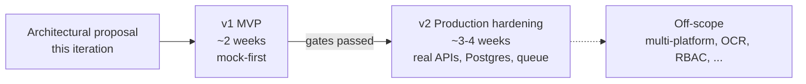

# ROADMAP.md

A two-phase development plan for the Meta Ad Library Intelligence Tool. The roadmap is intentionally short — long horizons (v3, multi-platform, OCR, RBAC) are listed as off-scope rather than promised.

Every numbered task here traces back to a section of [ARCHITECTURE.md](./ARCHITECTURE.md).

## Phases at a glance

The **gate** between v1 and v2 is not time-based; it is the success-metrics gate from [ARCHITECTURE.md §12](./ARCHITECTURE.md#12-success-metrics) plus the explicit infrastructure prerequisites listed in §v2 below.

---

## v1: MVP (mock-first, ~2 weeks)

**Goal.** A complete, demonstrable end-to-end research flow on synthetic data, with all interfaces in place so that swapping mocks for real Meta and Anthropic clients in v2 requires no changes outside the adapter modules.

**Non-goal.** Calibrated weights, real API access, multi-user support, hosting, or any production concern.

### Week 1: backend foundation

| Day | Deliverable | Traces to |
|---|---|---|
| 1 | Repo scaffolding: `backend/` (FastAPI, ruff, pytest), `frontend/` (Vite + React + TS + Tailwind). Toolchain only. | §3 |
| 1 | `backend/app/models/schemas.py` — Pydantic DTOs (`Ad`, `AdvertiserPage`, `ResearchRun`, `AdAnalysis`, `PageAnalysis`). Mirrored types for the frontend, generated via `openapi-typescript`. | §4 |
| 2 | `backend/app/fixtures/` — synthetic dataset for the five §6.5 cases: 30–50 ads across 4–5 advertiser pages, with deliberately constructed signal patterns. `analysis_sample.json` — paired canned AI responses. | §6.5 |
| 3 | `services/meta/` — `Protocol MetaClient` in `base.py`; `mock.py` reading fixtures with simulated cursor pagination; `client.py` real httpx-based skeleton with `tenacity` backoff and session limits (no live calls yet). Selection by `USE_MOCKS` config flag. | §3, §8 |
| 4 | `services/discovery/` — `normalizer.py` (URL → eTLD+1 + search terms), `aggregator.py` (signals + confidence formula), `ranker.py` (impressions desc, longevity fallback, top-N). Weights from §6.2 as constants. | §6 |
| 5 | `services/ai/` — `Protocol AdAnalyzer`; `mock.py` returning fixtures keyed by `ad_archive_id`; `prompts.py` with grounding rules and forbidden-vocabulary list; `analyzer.py` real Anthropic SDK skeleton with one-shot retry. Post-validation regex live in mock as well. | §7 |

### Week 2: frontend, integration, and tests

| Day | Deliverable | Traces to |
|---|---|---|
| 6 | FastAPI routes: `POST /api/research`, `GET /api/research/{id}`, `GET /api/research/{id}/export.md`, `GET /api/health`. SSE progress on the POST. | §5 |
| 7 | SQLite persistence via SQLAlchemy + Alembic; `repository.py` with `save()` / `get_by_id()`; TTL cleanup job. `services/export/markdown.py` deterministic templating. | §4, §5 |
| 8 | Frontend `Search` screen + form validation + React Query setup + API client. | §9.1 |
| 9 | Frontend `Research Dashboard` + `Advertiser Detail` (expanded card) with stats bar, timeline, advertiser cards, inline AI panel, export button. | §9.2, §9.3 |
| 10 | Test pass: pytest on aggregator (n-gram + domain + threshold cases), ranker (ordering invariants), normalizer (URL canonicalization edge cases), end-to-end `/api/research` against mocks, snapshot test on Markdown export. README with run instructions and demo script (the persona-grid case from §6.5). | §6, §12 |

### Exit criteria for v1

These are the gates. v1 is "done" when **all** of them are green:

- [ ] All five cases from [§6.5](./ARCHITECTURE.md#65-synthetic-cases) pass on fixtures with the documented confidences (±0.05 tolerance).
- [ ] Markdown export is deterministic — snapshot test stable across runs.
- [ ] UI renders the persona-grid case (5 advertiser pages, ~25 ads, 5 inline analyses) in under 1 second on mock data.
- [ ] `USE_MOCKS=true` is the only configuration needed to run the entire stack locally.
- [ ] README contains: setup, run, demo script (the case to walk through), and explicit list of what is and isn't real.
- [ ] All interfaces (`MetaClient`, `AdAnalyzer`) have the real-implementation skeleton in place — even if not exercised — so v2 starts from "fill in the implementation," not "design the interface."

### Success metrics measurable at v1

From [§12](./ARCHITECTURE.md#12-success-metrics), what's measurable at end of v1:

- **Ecosystem recall** on 5 synthetic cases — must hit the 0.7 target.
- **False-link rate** on the same set — ≤ 20%.
- **Grounding pass rate** of mock AI — must be 100% by construction (canned responses are pre-validated).
- **Time-to-result on mocks** — < 1s P95.

The "real-API" metrics (cost per run, AI grounding pass rate on live model, time on real Meta) are explicitly v2 territory.

---

## v2: Production hardening (~3-4 weeks)

**Goal.** Replace mocks with real implementations, gain operational visibility, and meet the v2 success-metric targets on real data.

### Gates to enter v2

These must be true before v2 begins:

- v1 exit criteria are all green.
- Real Meta Ad Library API access (developer token with `ads_archive`) is provisioned.
- Anthropic API key with at least $200 budget is available (for ground-truth runs and grounding-rule iteration).
- Ground-truth labelled set: at least 10 brand → related-pages cases, manually labelled.
- Hosting decision made (cloud provider chosen) — or explicit decision to remain local.

### v2 scope (in priority order)

1. **Real Meta integration.** Wire `MetaClient` to live API. Validate against the v1 fixture set first (regression), then run on the ground-truth set.
2. **Real Anthropic integration.** Wire `AdAnalyzer` to Sonnet 4. Measure first-try grounding pass rate; tune the forbidden-vocabulary list and prompt phrasing if below 80%.
3. **PostgreSQL migration.** Drop SQLite; migrate `research_runs` table; add a connection pool. Trigger: when concurrent users > 1 *or* DB size > 5 GB *or* multi-machine deployment is needed — whichever comes first.
4. **Background queue.** Move research-run execution to RQ or Celery; convert SSE progress source from in-process generator to Redis pub-sub. Necessary once requests can outlive a single HTTP timeout reliably.
5. **Basic auth.** API-key middleware (single shared key per workspace) — enough to deploy publicly without exposing the API. OAuth deferred unless explicitly requested.
6. **Confidence weight calibration.** Use the ground-truth set to fit weights via logistic regression on `is_same_ecosystem`. Compare against expert-set weights; only switch if ecosystem recall improves and false-link rate does not regress.
7. **Meta response cache.** Persistent cache on `(page_id, fetched_at_day)` with explicit invalidation on user request. SQLite-based cache from v1 graduates to a Redis or Postgres table.
8. **Observability.** Structured logs for: rate-limit hits per token per hour, AI grounding fail rate, P50/P95 research time, AI cost per run. Bare-minimum dashboard is a Grafana panel; alternative is a daily `/api/admin/stats` endpoint.
9. **Cost dashboard.** Per-run AI cost broken down by per-ad and per-page contributions. Surfaces in admin panel or CLI tool.
10. **Docker compose + minimal CI.** One-command spin-up; CI running pytest + frontend tests + Markdown snapshot.

### Exit criteria for v2

- [ ] **Ecosystem recall ≥ 0.85** on the 20+ ground-truth cases.
- [ ] **False-link rate ≤ 10%** on the same set.
- [ ] **Grounding pass rate ≥ 95%** after one-shot retry on a representative AI batch (at least 200 ads).
- [ ] **Time-to-result P95 < 2 min** on real Meta data, 50 advertiser pages, with the cache empty.
- [ ] **AI cost ≤ $0.80** per 50-page research run.
- [ ] **Graceful degradation under Meta rate limit** verified by chaos test (force `429` responses) — system completes the run with `[partial]` flags rather than failing.

---

## Off-scope (neither v1 nor v2)

Listed explicitly so the boundary is unambiguous:

- **Multi-platform** — TikTok, Google Ads Transparency Center, LinkedIn, X. The architecture allows plugging in additional `MetaClient`-shaped providers, but committing to them is a v3 conversation.
- **Visual signals** — perceptual hashes of creative images, OCR of in-image text. Powerful, but requires media downloads and a media-storage strategy. Out of scope for the initial versions.
- **Workspaces and RBAC** — single-tenant, single-shared-key in v2 is the explicit design.
- **A/B testing of prompts** — currently the AI prompts are version-controlled in code; an in-product prompt-experimentation framework is v3+.
- **Notion / Slides / Slack export** — Markdown is the only export format. Adapting Markdown to other formats is straightforward but is a separate workstream.
- **On-premise deployment with local LLM** — technically feasible (FastAPI + Postgres + Llama-class model), but operationally non-trivial and explicitly out of scope until requested.
- **Brand monitoring / continuous re-runs** — current model is on-demand research. Scheduled monitoring is v3+.
- **Conversion-funnel analytics** — we observe ads, not landing-page behaviour. Out of product scope.

---

## What this roadmap does *not* commit to

To stay within the engineering-honesty principles of this proposal:

- We do not commit to specific business KPIs (ROI, time saved per researcher, conversion-rate impact). The success metrics in §12 are measurable system properties, not business outcomes.
- We do not commit to v2 starting immediately after v1; the v2 gates depend on inputs (API access, ground-truth set) that are not in our control.
- We do not commit to weight values being optimal. The expert-set weights in §6.2 are a defensible starting point; the calibration task in v2 step 6 may move them.
- We do not commit to Sonnet 4 specifically beyond v1 — the `AdAnalyzer` interface allows switching providers if pricing or quality changes materially.

---

For the narrative shape of the oral defense, see [PITCH.md](./PITCH.md).
